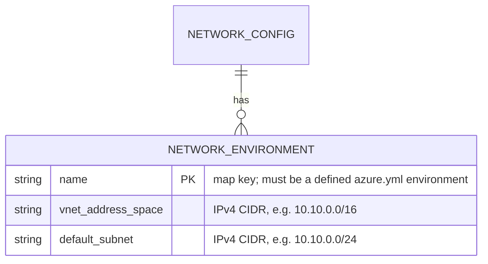

# ADR: Network model (`network.yml`)

This ADR covers the cross-cutting IP plan, which the data model deliberately leaves out of its two layers.

Pairs with [`data-model`](azure-data-model.md) (identity + templating) and [`naming-standard`](azure-naming-standard.md).

## Rules: ADR-AZ-NETWORK

### Rule ADR-AZ-NETWORK:1

The IP plan lives only in `network.yml` — never duplicate vnet/subnet ranges into a template's per-slot config. A template that needs ranges
reads them from `Get-Config -Config network` in its prepare hook and merges them into the parameter set.

> **Status.** The asset, its validator, and the prepare-hook range-merge mechanism are built and exercised by a fixture test (the
> `sample-with-prepost` template merges `vnet_address_space` / `default_subnet` into its parameter set). No _shipped production_ template
> consumes `network.yml` ranges yet — the shipped templates do not create a vnet. The mechanism is ready for the first production template
> that needs one.

- [The asset](#the-asset)

### Rule ADR-AZ-NETWORK:2

Key the plan by environment name, matching `azure.yml`; the two assets stay in sync via the validator, not by convention alone.

- [Validation (`Assert-NetworkConfig`)](#validation-assert-networkconfig)

### Rule ADR-AZ-NETWORK:3

One address space per environment — multi-region-per-environment is out of scope (each environment maps to one region).

- [The asset](#the-asset)

### Rule ADR-AZ-NETWORK:4

Per-subscription envs (`nsub`/`psub`) need no network entry — they carry no vnet, so the standard-env requirement skips them (a
`nsub`/`psub` entry is not forbidden, just pointless).

- [Validation (`Assert-NetworkConfig`)](#validation-assert-networkconfig)

## Context

A template that creates a virtual network needs an address space and subnet ranges. Those ranges are **global, cross-cutting state**: every
environment must get a non-overlapping block, and the same block must be referenced identically by every template that touches that
environment's network. If the ranges lived in each template's per-slot `configuration/[<customer>/]<env>.yml`, the plan would be duplicated
across templates and drift — the exact failure [`one-config-to-rule-them-all`](../../notes/one-config-to-rule-them-all.md) warns against.

So the IP plan is a **single source of truth** sitting beside `azure.yml`: `automation/Catzc.Azure.Templates/configs/network.yml`. A
template merges the right ranges in at build time through its PrePost prepare hook (see
[`prepost-extension-modules`](../automation/powershell/prepost-extension-modules.md)), so the central plan is read, never copied.

This is a third global asset, distinct from the two layers in [`data-model`](azure-data-model.md): it is not identity
(tenant/customer/environment/subscription) and not templating (template/options/slot). It is pure topology — the network plan keyed by
environment.

## Decision

### The asset

`configs/network.yml` declares one entity — a per-environment IP plan — keyed by environment **name** (the same keys as `azure.yml`'s
`environments`). It is loaded by `Get-Config -Config network`, which auto-dispatches the private `Assert-NetworkConfig` (by the
`Assert-<TitleCase(name)>Config` convention, in the owning module's scope) on load (a bad file throws at read time).



```yaml
# configs/network.yml
environments:
  dev:
    vnet_address_space: 10.10.0.0/16
    default_subnet: 10.10.0.0/24
  test:
    vnet_address_space: 10.20.0.0/16
    default_subnet: 10.20.0.0/24
  # … one entry per standard environment
```

### Validation (`Assert-NetworkConfig`)

- **Required shape.** Top-level `environments` map; each entry has `vnet_address_space` and `default_subnet`.
- **Format.** Each environment name is a valid lower-snake_case identifier (`^[a-z][a-z0-9_]*$`); each range is an IPv4 CIDR (`a.b.c.d/n`,
  `0 ≤ n ≤ 32`), validated with `[System.Net.IPAddress]`.
- **Cross-asset integrity with `azure.yml`** (the join):
  - every network environment is a **defined `azure.yml` environment** (no ghost entries);
  - every **standard** `azure.yml` environment has a network entry;
  - **per-subscription** environments (`per_subscription: true` — `nsub`/`psub`) are **exempt**: they identify a subscription's foundation
    (Log Analytics + Key Vault) and carry no vnet, so they need no IP plan.
- All violations are collected and thrown together (fail with the full list, not the first error).

### How this is enforced

- `Get-Config -Config network` loads and auto-validates via the convention validator `Assert-NetworkConfig`.
- `Assert-NetworkConfig` performs the shape, format, and cross-asset checks above.
- The shipped `network.yml` is exercised by the same integrity discipline as `azure.yml` (see
  [`test-automation`](../automation/test-automation.md)).

## Consequences

- The IP plan has one home; templates reference it, so ranges cannot drift across templates.
- Adding an environment to `azure.yml` forces a matching `network.yml` entry (or the standard-env rule fails) — the two assets cannot
  silently diverge.
- Per-subscription identity environments stay network-free by design.
- The network plan is a separate, self-contained asset — extending it (new env, new range) is a one-file change, validated on load.
