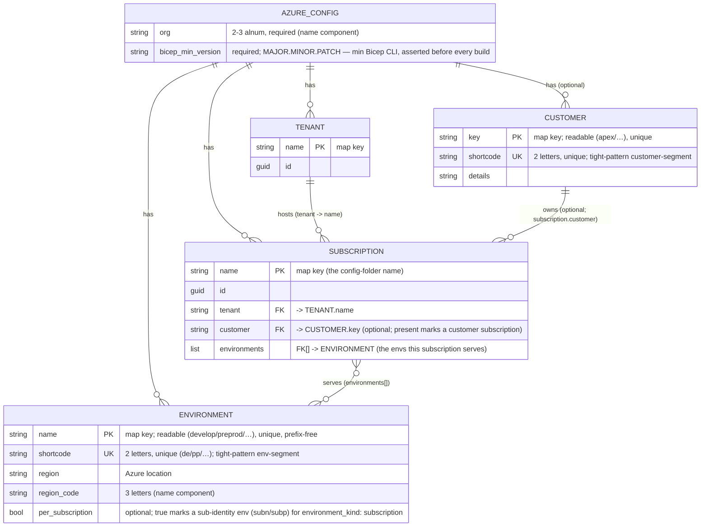
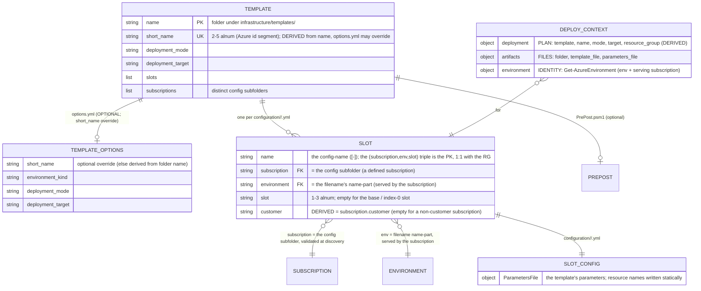

# ADR: Templating data model (`azure.yml` + `infrastructure/`)

Pairs with [`naming-standard`](naming-standard.md), which defines the resource-name components this model feeds.

## Rules: ADR-DATAMOD

### Rule ADR-DATAMOD:1

Two config layers — identity (`azure.yml`) and templating (`infrastructure/templates/`) — join on a subscription name; a template targets a
subscription by naming a config folder after it, with no subscription-group entity.

- [Layer 1 — Identity (`azure.yml`)](#layer-1--identity-azureyml)

### Rule ADR-DATAMOD:2

One config file ⟷ one (subscription, env, slot) ⟷ one Azure resource group; every config lives at
`configuration/<subscription>/<env>[-<slot>].yml`, and listing that tree is the resource-group inventory.

- [Layer 2 — Templating (`infrastructure/templates/<name>/`)](#layer-2--templating-infrastructuretemplatesname)

### Rule ADR-DATAMOD:3

All named entities in `azure.yml` are maps keyed by name, so duplicate names are structurally impossible; the config folder — not a group
entity — is the subscription selector.

- [Layer 1 — Identity (`azure.yml`)](#layer-1--identity-azureyml)

### Rule ADR-DATAMOD:4

Customer is derived from the subscription (`subscription.customer`), not a path dimension or deploy arg — its presence marks a customer
deployment and renders into resource names.

- [Layer 2 — Templating (`infrastructure/templates/<name>/`)](#layer-2--templating-infrastructuretemplatesname)

### Rule ADR-DATAMOD:5

The resource-group name is derived by `Get-BicepResourceGroupName`, never hand-typed; the name-component order is a durable code setting
(`Get-AzureNameOrder`).

- [The name builder](#the-name-builder)

### Rule ADR-DATAMOD:6

Resource names for a template's own parameters are written statically in the per-slot config; the build passes them through unchanged (no
generation or validation).

- [Resource names](#resource-names)

### Rule ADR-DATAMOD:7

The cross-layer joins live in PowerShell, resolved on demand (`Resolve-BicepDeploymentSubscription`, `Get-AzureSubscription`,
`Get-AzureEnvironment`, `Get-BicepDeploymentContext`); deploy-time subscription inference is devbox-only — pipelines require an explicit
`-Subscription`.

- [Runtime resolution (the joins)](#runtime-resolution-the-joins)

### Rule ADR-DATAMOD:8

Per-record shape is schema-validated; cross-record integrity is owned by `Assert-AzureConfig`; the cross-layer link (every config under a
defined subscription serving its env) is enforced at discovery by `Get-BicepTemplates`.

- [Validation](#validation)

## Context

`Catzc.Azure.Templates` is configured by **two layers**:

| Layer                       | Source of truth                                                             | Entities                                                |
| --------------------------- | --------------------------------------------------------------------------- | ------------------------------------------------------- |
| 1 — Identity / topology     | `automation/Catzc.Azure.Templates/configs/azure.yml` (one declarative file) | tenant, customer, environment, subscription             |
| 2 — Templating / deployment | the `infrastructure/templates/<name>/` filesystem (discovered)              | template, options, slot (per-RG config), deploy context |

A third global asset, `configs/network.yml`, carries the cross-cutting IP plan (per-environment vnet / subnet ranges) alongside `azure.yml`.
It is a separate concern with its own schema and cross-asset integrity rules — see [`network-model`](network-model.md). This ADR covers
identity (Layer 1) and templating (Layer 2); the network plan is documented there.

The two layers join on a **subscription name** (a string): a template names a subscription by putting a config folder under it
(`configuration/<subscription>/`), and Layer 1 resolves that subscription to its tenant, its serving environments, and (optionally) its
customer.

Governing principle:

> **Optimize for ease of configuration and codebase-as-source-of-truth.** A clear, visible mapping between the config and what ends up in
> Azure beats config that is normalized for the code's convenience. **Complex joins / resolution in PowerShell are acceptable.**

## Decision

### Layer 1 — Identity (`azure.yml`)

All named entities are **maps keyed by name** (uniform access; duplicate names are structurally impossible). One global — `org` — supplies a
name component. The component _order_ is **not** here — it is the `ado_naming` repo variant, `Get-AdoNaming` (see
[The name builder](#the-name-builder) and [repo-variants](../repository/repo-variants.md)).

There is **no subscription-group entity**. A template targets a subscription _directly_ by naming a config folder after it — the folder _is_
the selector.

A subscription declares its **`tenant`**, the **`environments`** it serves, and — optionally — a **`customer`**, naming a customer defined
in `customer.yml` by its key OR its 2-char shortcode (see [`customer-model`](customer-model.md)). The `customer` field is the single signal
that a subscription belongs to a customer: its presence makes config under that folder a customer deployment, and the customer renders into
the resource names of anything deployed there (see [`naming-standard`](naming-standard.md)). A subscription is named **directly** — there is
no group indirection between a template and the subscription it targets.

A **customer** (defined in `customer.yml`) carries two stored identifiers, mirroring an environment: a readable **`key`** (the map key — the
customer-segment of _generous_ resource names) and a 2-char **`shortcode`** (unique, the customer-segment of _restricted_
`kv`/`storage`/`vm` names — so a readable key never costs a tight name a byte).

A subscription's `customer` is read through the single accessor `Get-AzureSubscriptionCustomer`, shared by `Assert-AzureConfig` (validation)
and `Get-AzureSubscription` (naming resolution) so the two cannot drift.

**No uniqueness or completeness join.** Multiple subscriptions may serve the same environment (e.g. `shared_nonprod` and a customer's
`apex_nonprod` both serve `dev`); that is expected. Which subscription a deploy targets is named by the config folder (and disambiguated at
deploy by `-Subscription` when several apply — `Resolve-BicepDeploymentSubscription`), so there is nothing to resolve or validate for
uniqueness in `azure.yml`.

### Layer 2 — Templating (`infrastructure/templates/<name>/`)

Deployable templates live in `infrastructure/templates/<name>/` (discovered by `Get-BicepTemplates`). Reusable bicep modules live in the
sibling `infrastructure/modules/` — referenced by templates via a relative `module` declaration and inlined by `az bicep build`; they are
**not** discovered as templates and carry no `options.yml` / `configuration/`.

**One config file ⟷ one (subscription, env, slot) ⟷ one Azure resource group.** Every config lives at
`infrastructure/templates/<name>/configuration/<subscription>/<env>[-<slot>].yml` — the only folder type, the only filename pattern. The
folder names the subscription (a key in `azure.yml.subscriptions`); the filename is `<env-name>[-<slot>]` — `develop.yml` (the base /
index-0 slot) or `develop-blue.yml` (a special slot). Discovery parses the filename by splitting on the first `-`: the `name` part must be a
defined environment, the remainder is the optional `slot` (≤3 alnum). There are **no config files directly under `configuration/`** — every
config belongs to a subscription folder.

**Customer is derived, not a path dimension.** A config's customer is `subscription.customer` of its folder (empty for a non-customer
subscription). So "is this a customer config?" is answered by the subscription, not by the path — declaring `dev.yml` under
`configuration/<customer-subscription>/` is, by that fact, a customer deployment. Deploy/build name the env and slot as **distinct args**
(`-Environment develop [-Slot blue]`); the subscription is inferred from the config files and named explicitly only to disambiguate
(`-Subscription`). Listing a template's `configuration/` tree _is_ the inventory of its resource groups.

- `short_name` (the globally-unique Azure id segment) is **derived** from the template folder name (first 5 `[a-z0-9]`, hyphens dropped) by
  `Catzc.Azure.Templates.BicepShortName`; `Get-BicepTemplates` resolves it and enforces uniqueness across all templates. `options.yml` is
  **optional** and, when present, may **override** `short_name` and/or declare `deployment_mode` / `deployment_target` / `environment_kind`
  (strict schema, validated at discovery by `Read-BicepTemplateOptions`). It does **not** declare which subscriptions the template targets —
  that is implied by the config subfolders. See [`naming-standard`](naming-standard.md#rule-adr-naming2).
- `environment_kind` (`standard` | `subscription`, default `standard`) is the template's one classification bit: every config's env must
  match it — `subscription` ⇒ a `per_subscription` env (`subn`/`subp`, deployed once per subscription), `standard` ⇒ an ordinary env
  (`dev`/`test`/…). Enforced per-config by `Get-BicepConfigClassViolations` (shared by discovery and `Assert-BicepTemplate`). The slot is
  NOT a template-level bit — a single template may freely **mix** a base `<env>.yml` and slotted `<env>-<slot>.yml` configs.
- The slot **metadata** is `{ name, environment, slot, subscription, customer }`, parsed from the path (`<subscription>/<env>[-<slot>]`) by
  `Get-BicepTemplates`; `customer` is derived from `subscription.customer`. The slot's **config content** carries a `ParametersFile` of the
  template's parameters — including any resource names, written statically (see [Resource names](#resource-names)).

### The name builder

Every Azure name is assembled deterministically by `Get-AzureResourceName` from the component set — the env (its **name** for generous
patterns, its 2-char **shortcode** for the restricted `kv`/`storage`/`vm` patterns), `slot`, region_code, org, short_name, optional
**customer** (likewise its readable **key** for generous patterns, its 2-char **shortcode** for restricted) / `role`, and the resource type
— arranged by the **active order**, the `ado_naming` variant (`Get-AdoNaming`). The **customer that renders is derived from the resolved
subscription** (`subscription.customer`); the subscription itself is **never** a name component. `env` and `slot` are separate segments.
Per-type render pattern (separator + limit) comes from `Get-AzureNamePatternSet` via `Get-AzureResourceTypeSet`; the name is asserted
against the limit.

The **resource-group name** is derived from (env, slot, customer) by `Get-BicepResourceGroupName` (over the builder) and is the single
source for both the deploy target (`Get-BicepDeploymentContext`) and the tracking-tag scope (`Set-BicepTrackingTagSet`), so the two never
drift.

### Resource names

Resource names for a template's own parameters are written **statically** in
`infrastructure/templates/<name>/configuration/<subscription>/<env>[-<slot>].yml` under `ParametersFile.parameters`. The build passes them
through unchanged — it does not generate or validate them. (Automated generation/validation of in-template names against the builder is
intentionally deferred; the resource-group name above is the only name the system derives.)

### Runtime resolution (the joins)

The config is resolved into runtime objects on demand — where the "complex joins in PowerShell" deliberately live:

- `Resolve-BicepDeploymentSubscription -Template <t> -Environment <env> [-Slot <s>] [-Subscription ]` → the one subscription a deploy
  targets: inferred from the config files when exactly one serves the `(env, slot)`, the explicit `-Subscription` when several do (else it
  throws). The single place the deploy-time resolution rule lives. **Inference is devbox-only:** `Deploy-Bicep` requires an explicit
  `-Subscription` when running in a pipeline (`Test-IsRunningInPipeline`), so a later config addition that makes `(env, slot)` ambiguous
  across subscriptions can never silently retarget — or break — an existing pipeline's deploy.
- `Get-AzureSubscription ` → `{ name, id, customer?, tenant: { name, id } }` — a by-name lookup (no join), with the tenant rebuilt from
  the map key.
- `Get-AzureEnvironment <env> -Subscription ` → `{ name, shortcode, region, region_code, subscription }`; asserts the subscription
  serves the env and embeds `Get-AzureSubscription `.
- `Get-AzureSubscriptionEnvironment ` → the subscription's per-subscription identity env (subn/subp), for templates that must locate
  the once-per-subscription foundation in the same sub.
- `Get-BicepDeploymentContext` → three concern-objects: **plan** (`deployment`), **artifacts**, and **identity** (`environment`). The
  customer that renders into names is read off the resolved subscription.

### Derived accessors

Thin read-only lookups and argument-completers over the two layers (no joins of their own); listed here so the public surface is complete:

| Function                          | Returns / purpose                                                             |
| --------------------------------- | ----------------------------------------------------------------------------- |
| `Get-AzureCustomers`              | the customer keys from `customer.yml`                                         |
| `Get-AzureBicepEnvironmentKinds`  | the allowed `environment_kind` values (`standard`, `subscription`)            |
| `Get-AzureBicepDeploymentModes`   | the allowed `deployment_mode` values for `options.yml` validation             |
| `Get-AzureBicepDeploymentTargets` | the allowed `deployment_target` values for `options.yml` validation           |
| `Get-AzureBicepMinVersion`        | `bicep_min_version` from `azure.yml` (asserted by `Assert-AzCliBicep`)        |
| `Get-BicepTemplateCustomers`      | the distinct customers across a template's config subfolders                  |
| `Get-BicepTemplateSubscriptions`  | the distinct subscriptions (config subfolders) a template targets (completer) |
| `Get-BicepTemplateSlots`          | the distinct slots a template declares (completer)                            |

### Validation

- **Per-record shape** (identifiers, GUIDs, enums, formats) is schema-expressible.
- **Cross-record integrity** (FKs, env name/shortcode uniqueness + prefix-free names, `customer` references a defined customer, ≤1
  per-subscription env per subscription) is owned by `Assert-AzureConfig`. There is no cross-subscription resolution-uniqueness check —
  multiple subscriptions may serve one env.
- The **cross-layer** link is enforced at **discovery** (`Get-BicepTemplates`) and collected by `Assert-BicepTemplate`, sharing the
  per-config rule `Get-BicepSubscriptionConfigViolations`: every config sits under a `configuration/<subscription>/` folder that is a
  **defined subscription serving the config's env**; no config sits directly under `configuration/`.

## Consequences

- At-a-glance source-of-truth ⟷ Azure mapping: one config file = one resource group; the `configuration/` folder is the RG inventory,
  grouped by subscription.
- The resource-group name is **derived**, not hand-typed. The name-component **order** is the `ado_naming` repo variant (`Get-AdoNaming`);
  changing it re-spells every derived name.
- Maps keyed by name make duplicate tenant/subscription names structurally impossible.
- A template targets a subscription by naming a config folder after it — no group entity, no `subscription_groups` in `options.yml`. The set
  of config subfolders _is_ the set of target subscriptions.
- **Customer** is derived from the subscription (`subscription.customer`), not a path dimension or a deploy arg. It both marks a customer
  deployment and renders into the names. Like an environment, a customer carries a readable **`key`** + a 2-char **`shortcode`** so it stays
  readable in generous names and cheap (2 bytes) in tight ones.
- Multiple subscriptions may serve the same env+slot for one template; the deploy infers the subscription when unique and needs
  `-Subscription` only to disambiguate (the accepted downside).
- Build artifacts are keyed on the subscription (`parameters.<subscription>.<config>.json`) — uniform and structurally collision-free in the
  shared build folder, with no validation guard to remember.
- Each environment maps to one region; multi-region-per-environment is out of scope (see [`naming-standard`](naming-standard.md)). Each env
  carries a readable, prefix-free **`name`** (the deploy/config handle + relaxed env-segment) and a 2-char **`shortcode`** (the restricted
  env-segment).
