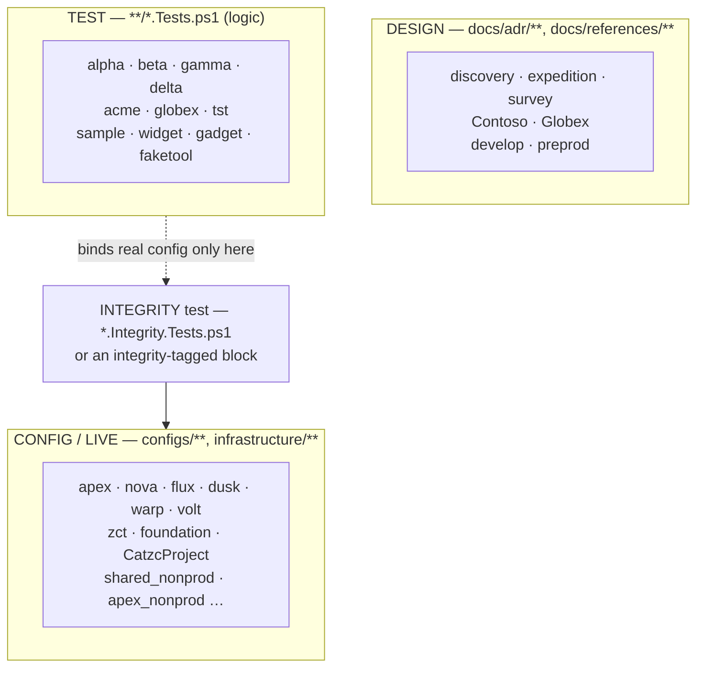

# ADR: Domain-language separation — three domains, three terminologies

## Rules: ADR-LANG

### Rule ADR-LANG:1

The repository speaks in three registers that must not bleed together — each a **domain** with its own **terminology** and **modelling
language**: the **design** domain (ADRs and reference docs, whose examples are the discovery theme), the **test** domain (hermetic tests,
whose identities are deliberately-distinct fixtures), and the **config/live** domain (the shipped configuration, whose identities are the
real-customer-shaped names the demo deployment maps to). A token from one domain appearing in another is a language break.

- [The three domains](#the-three-domains)

### Rule ADR-LANG:2

A **logic** test names **fixture** identities, never **live** ones. Using a real customer, subscription, org, template, or ADO-project name
as a value in a logic test couples it to the shipped config (ADR-TEST:3) and blurs the test/live vocabulary; it uses `acme`/`globex`,
`alpha`/`beta`, `tst`, `sample`, `widget` instead.

- [The test/live boundary is the enforced one](#the-testlive-boundary-is-the-enforced-one)

### Rule ADR-LANG:3

An **integrity** test is the one sanctioned bridge: it binds the real shipped assets and therefore names live identities by design
(ADR-TEST:1). Live identities are legitimate inside an `integrity`-tagged block and nowhere else in a logic-bearing test file.

- [The test/live boundary is the enforced one](#the-testlive-boundary-is-the-enforced-one)

### Rule ADR-LANG:4

The **design** domain uses the discovery theme (ADR-EXAMPLE) — `discovery`/`expedition`/`survey`, `Contoso`/`Globex`, `develop`/`preprod`.
Test fixtures never appear as ADR examples. Live identities may appear in docs, but only where an ADR documents the actual data model as its
subject (`azure-data-model.md` naming `apex`/`nova`), not as illustration.

- [The design domain and the doc asymmetry](#the-design-domain-and-the-doc-asymmetry)

### Rule ADR-LANG:5

Enforcement is **semantic, not textual**: the tag-aware AST gate `Test-LogicTestIdentity` resolves each test's Pester tag and reads its
**AST string literals** — comments, help, and here-doc trivia are not AST nodes, so illustration is invisible to it — forbidding a live
identity everywhere except inside an `integrity` block. A file-glob spell-checker cannot draw this line: it tokenizes text, not meaning, and
example vocabulary legitimately pervades comments, doc-example blocks, and demo data in every file type, so cspell does not enforce the
separation.

- [Why a spell-checker cannot enforce this](#why-a-spell-checker-cannot-enforce-this)

### Rule ADR-LANG:6

The forbidden live-identity set is **derived from the shipped config** (`Get-LiveIdentityTokens` reads `customer.yml`, `azure.yml`,
`ado.yml`, and the shipped templates), never hand-listed, so it is always current — add a customer and it is immediately banned from logic
tests. The terminology registry's per-category `scope` (ADR-SPELL) is the machine-readable **domain map** the gate reads to know which
category is `fixture` vs `azure-live` vs `adr-example`; it is a declaration of domain membership, not itself a cspell rule.

- [The forbidden set is derived, and the scope map is the source of intent](#the-forbidden-set-is-derived-and-the-scope-map-is-the-source-of-intent)

### Rule ADR-LANG:7

Matching is **exact and conservative**. A distinctive live identity (customer, subscription, org, template, project) is flagged as a bare
string literal that IS the token, not a substring or path segment (`'automation/Catzc.X'` never trips the deployable-unit name
`automation`); an ambiguous one — an environment name like `test`/`dev` — is flagged only where it is bound to an identity parameter
(`-Environment`/`-Env`/ `-Shortcode`), never as prose. Structural names that collide with folder literals (deployable-unit/pipeline names)
are out of scope. The reverse boundary — a **fixture** identity in a shipped config **value** — is enforced the mirror way, by walking the
parsed config's keys and values (comment-blind) rather than its raw text.

- [Exact, conservative, phased](#exact-conservative-phased)

## Context

The repository's example vocabulary is already governed in three separate places — the discovery theme for documentation
([documentation-examples](documentation-examples.md), `ADR-EXAMPLE`), the fixture identities for tests
([test-automation](../automation/test-automation.md#rule-adr-test3), `ADR-TEST:3`), and the real identities of the data model
([data-model](../azure/azure-data-model.md), [naming-standard](../azure/azure-naming-standard.md),
[customer-model](../azure/azure-customer-model.md)). What was missing is the rule that ties them together: these are three faces of one
discipline — a token belongs to exactly one domain, and it does not appear in the others. Without that rule, a logic test drifts into naming
a real customer (testing the config by accident), an ADR illustrates with a test fixture, and the three vocabularies blur.

This ADR names the discipline and records how it is enforced — and, as importantly, how it is **not**, because the obvious mechanism does
not work.

### The three domains

The design domain is the highest level of abstraction — the _why_ — and its illustrations are obviously-fictional and theme-consistent so a
reader knows at a glance they are examples. The test domain is hermetic: its identities are chosen to be visibly-distinct from anything
real, so a reviewer who sees `acme`/`alpha`/`tst` knows nothing production is in play. The config/live domain is the deliberate opposite —
it maps to real-customer-shaped identities because it is the demonstration deployment, and it must read like a real one. The three are
rarely connected; the one sanctioned crossing is an integrity test, which reaches from the test tree into the live config on purpose.

### The test/live boundary is the enforced one

Of the three pairwise boundaries, the test/live one is where a mechanical gate earns its keep, because it is the one a logic test can
silently violate — hardcoding a real customer name reads fine and passes, yet couples the test to the shipped config. The rule is therefore
sharp: a live identity is legitimate **only** inside an `integrity`-tagged block (where binding the real config is the whole point), and a
leak anywhere else in a logic-bearing test file is a violation. This makes a mixed file — one `Describe` with both a `logic` and an
`integrity` Context — work without being split: the integrity block's identities are carved out, and the rest is held to fixtures.

### The design domain and the doc asymmetry

Design examples are the discovery theme, and this is asymmetric on purpose. A test fixture (`acme`, `alpha`) must never appear in an ADR —
an ADR that illustrated with test fixtures would be borrowing the wrong domain's vocabulary. But a live identity legitimately appears in a
doc when the doc's subject **is** that identity: `azure-data-model.md` names `apex` and `nova` because it is describing the real data model,
not illustrating a general point. So docs admit live identities as a documented subject, never fixtures as illustration.

### Why a spell-checker cannot enforce this

The tempting mechanism is a domain-scoped spelling dictionary — accept `acme` only under tests, `apex` only under configs. It does not work,
because a spell-checker tokenizes text and cannot tell an illustration from a datum. Example vocabulary legitimately pervades every file
type: a config carries a comment illustrating `[acme, globex]`, a pipeline carries a `'Contoso Ltd'` demo record, a function carries a
`.EXAMPLE` help block naming a sample template. A file-glob scope that forbade those tokens outside their domain would fire on all of that
legitimate illustration, and silencing each with an inline ignore is exactly the ceremony this codebase rejects
([poka-yoke](../principles/poka-yoke.md)). So the separation is not a spelling rule. It is enforced semantically, by a gate that reads
structure, not text.

### The forbidden set is derived, and the scope map is the source of intent

The set of live identities a logic test may not name is not a maintained list — it is read from the shipped config, so it cannot drift: a
customer added to `customer.yml` is banned from logic tests the moment it exists, and one renamed updates the ban automatically. The
terminology registry's per-category `scope` ([spell-out-names](../automation/powershell/spell-out-names.md)) declares which domain each
vocabulary category belongs to — `fixture` is the test domain, `azure-live` the config domain, `adr-example` the design domain. That map is
the machine-readable statement of intent; the gate consumes it, and a future phase can widen what it drives.

### Exact, conservative, phased

The gate matches a string literal that **is** a live identity, never a substring — a repository path `automation/Catzc.X` does not trip the
deployable-unit name `automation`. Structural names that collide with folder literals are left out of the forbidden set entirely, because a
name a test must legitimately type is not an identity leak. Distinctive identities (customers, subscriptions, org, templates, ADO project)
match exactly wherever they appear; ambiguous environment names, pervasive in test prose, match only in an identity-parameter position; and
the reverse boundary — a fixture identity sitting in shipped config **values** rather than comments — is caught by walking the parsed
config, not its text. The bias throughout is toward a gate that is right when it fires, not one that fires often.

## Decision

The repository carries three domains — design, test, config/live — each with its own terminology, and a token from one does not appear in
another. The test/live boundary is enforced mechanically by a tag-aware, comment-blind AST gate: a logic test may not name a live identity
as a string literal outside an `integrity` block. The forbidden set is derived from the shipped config; the terminology `scope` map declares
the domains; a file-glob spell-checker is not used, because it cannot separate illustration from data.

### How this is enforced

- **`Test-LogicTestIdentity`** (`Catzc.Base.QualityGates`) is the gate: it builds the live-identity set, scans every logic-bearing test
  file, and throws on a leak. It runs as an `integrity` test, so it gates every build.

- **`Get-LiveIdentityTokens`** (private) derives the forbidden set from `customer.yml`, `azure.yml`, `ado.yml`, and the shipped templates —
  the set is always current with the config.

- **`Get-LogicTestIdentityFinding`** (private) is the AST walk: it classifies a file by its Pester `-Tag` values, carves out the
  script-block extent of every `integrity`-tagged block, reports an exact-match live identity anywhere else, and reports an environment
  identity bound to an identity parameter. Comments and help are not AST nodes, so illustration is invisible to it.

- **`Test-ConfigIdentityHygiene`** (`Catzc.Base.QualityGates`) is the mirror gate — the reverse boundary: it walks every shipped
  `configs/*.yml` and `infrastructure/**` file's parsed keys and values and throws on a test-fixture identity, so a fixture is never
  committed as production data. It too runs as an `integrity` test.

- **`Get-FixtureIdentityTokens`** (private) derives the forbidden fixture set from the `tests/assets/config/` fixtures — always current with
  the test configs, and disjoint from the live set by construction.

- **The terminology `scope` map** ([spell-out-names](../automation/powershell/spell-out-names.md)) records each category's domain, and
  `Test-Terminology` keeps the registry honest — but cspell does not scope on it (ADR-LANG:5).

- **Code review** covers the design-domain rules a gate does not — an ADR illustrating with a test fixture (ADR-LANG:4), or a live identity
  in a doc that is not documenting that identity as its subject.

## Consequences

- A logic test cannot silently name a real customer, subscription, org, template, or ADO project; the leak fails the build with the
  offending token, its config source, and the fixture to use instead.

- Mixed logic/integrity files need no restructuring: the gate excludes integrity blocks by AST extent, so the common
  `Describe { Context integrity … } { Context logic … }` shape is handled as-is.

- The forbidden set never goes stale — it is the config — so the gate keeps working as customers and subscriptions come and go, with nothing
  to maintain.

- False positives are near zero by construction (exact match, structural names excluded, comments invisible), which is what lets the gate
  run on every build without a suppression culture.

- The cost is that the mechanism is a gate, not a one-line config: the separation is a property proven by reading structure, and widening it
  (environment names, config-data values, the design/test boundary) is deliberate phased work rather than a scope glob.

## Related

- [documentation-examples](documentation-examples.md) (`ADR-EXAMPLE`) — the design domain's discovery-theme vocabulary.
- [test-automation](../automation/test-automation.md) (`ADR-TEST`) — logic vs integrity, and the fixture-identity rule (`ADR-TEST:3`) this
  gate mechanizes.
- [data-model](../azure/azure-data-model.md), [naming-standard](../azure/azure-naming-standard.md),
  [customer-model](../azure/azure-customer-model.md) — the config/live domain's real identities.
- [spell-out-names](../automation/powershell/spell-out-names.md) (`ADR-SPELL`) — the terminology registry and the per-category `scope` map.
- [poka-yoke](../principles/poka-yoke.md), [reduce-variability](../principles/reduce-variability.md) — the principles a mechanical,
  low-ceremony gate instantiates.

## Dora explains

DORA's research on pervasive security and streamlining change approval emphasizes preventing configuration drift and production leaks; a
tag-aware AST gate that enforces domain boundaries catches silent violations where text-based checks cannot, so live identities never leak
into test code.

- [Pervasive security](https://dora.dev/capabilities/pervasive-security/) — mechanical enforcement prevents live identities from leaking
  into logic tests where they could cause production incidents.
- [Continuous integration](https://dora.dev/capabilities/continuous-integration/) — AST-based gates run on every build and fail with exact,
  actionable messages.
- [Code maintainability](https://dora.dev/capabilities/code-maintainability/) — semantic enforcement (not text-based) is what lets
  illustration remain legible while protecting the boundary.
- [DORA research program](https://dora.dev/research/) — the overview these findings sit within.
